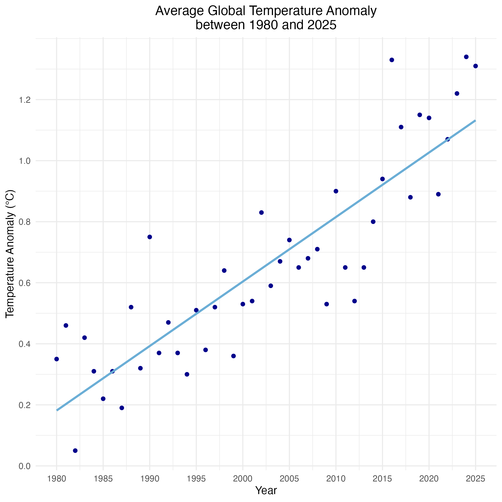
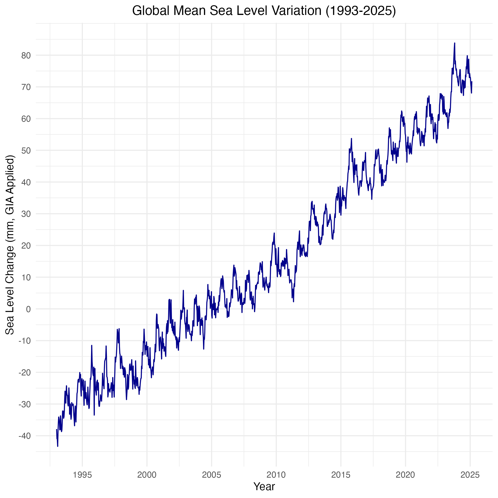
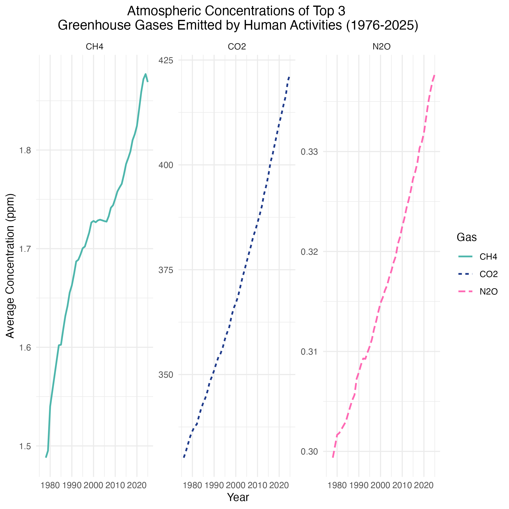
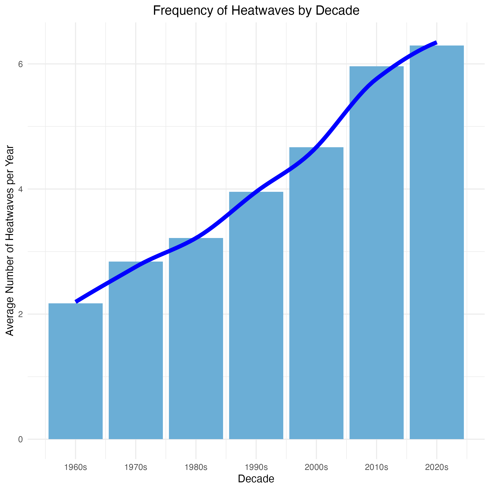
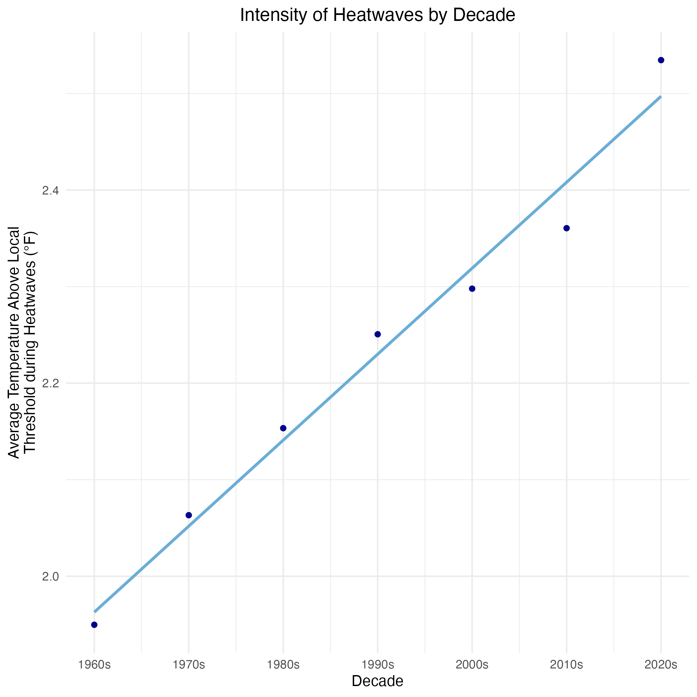
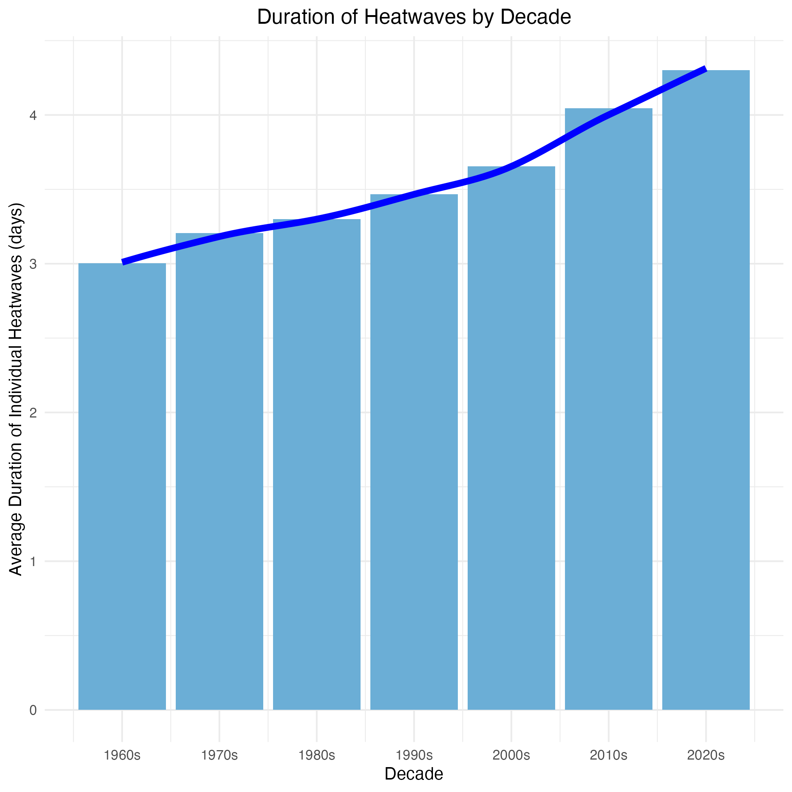
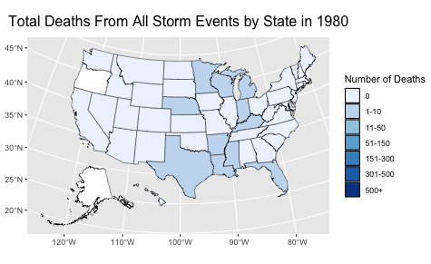

```{r setup, include=FALSE}
knitr::opts_chunk$set(echo = TRUE)
library(knitr)
library(plotly)
library(dplyr)
```


## Introduction

The climate crisis has been one of the most pressing issues impacting the world in recent years. As temperatures rise and greenhouse gas emissions increase, weather patterns have been affected, becoming more unpredictable and devastating. With this in mind, I was inspired to explore the reasons behind the deteriorating health of our environment, as well as the impacts of these changes on the frequency and severity of extreme weather events. I aim to answer the following questions in this report:

1. How fast is global warming occurring, and what is the primary cause?
2. Have the intensity, cost, and frequency of extreme weather events increased throughout the decades?
3. Have the number of deaths from extreme weather increased over time?

## The Current State of Our Climate

Two major indicators of climate health are global temperature anomaly and sea level changes. The global temperature anomaly measures the difference between the average global temperature and a baseline average. A positive anomaly means global warming is occurring, while a negative anomaly would indicate temperatures are cooling. As warming occurs, one of the most significant effects is an increase in sea levels. The melting of glaciers and ice sheets combined with the warmer ocean waters increasing in volume causes sea levels to rise. 

### Figure 1: Scatterplot of Average Temperature Anomaly



### Figure 2: Line Graph of Global Mean Sea Level Variation



The scatter plot of global temperature anomalies between 1980 and 2025 (Figure 1) shows a clear increasing trend, indicating that global temperatures have been rising consistently over the past several decades. This shows that global warming is continuing to intensify each year, degrading the health of the environment. The line graph of sea levels from 1993 to 2025 (Figure 2) has an overall increasing trend. This is consistent with the trend seen in the scatter plot, which is expected because rising sea levels are a direct consequence of increasing temperatures. Both of these plots together are convincing evidence that global warming is accelerating over time.

## The Driving Forces behind Global Warming

Now that we have established that global warming is occurring at an alarming rate, the next step is to investigate why this change is happening The primary contributor to increasing global temperatures are greenhouse gas (GHG) emissions. GHGs are gases that trap heat in the atmosphere and prevent it from being able to escape. When they are present in excess, they can cause an excessive warming effect on the planet which is often called the greenhouse effect. The four major GHGs that are responsible for global warming are carbon dioxide, methane, nitorus oxide, and a group of gases called halocarbons. All four of these GHGs are primarily emitted by human activities, such as deforestation, burning fossil fuels, oil drilling, and more. 

### Figure 3: Donut Chart of Radiative Forcing Percentages of the Top 4 GHGs

```{r, echo = F,warning = F, message= F}

#PIE CHART OF GHG RADIATIVE FORCING 

r_forcing <- read.csv("radiativeforcing.csv")

sum = sum(r_forcing[45,2:7])
forcing_carbon = r_forcing[45, 2] / sum
forcing_methane = r_forcing[45, 3] / sum
forcing_nox = r_forcing[45, 4] / sum
forcing_halocarbons = sum(r_forcing[45, 5:7])/sum

rf_percents = c(forcing_carbon, forcing_methane, forcing_nox, forcing_halocarbons)
ghgs = c("Carbon Dioxide", "Methane", "Nitrous Oxide", "Halocarbons")
rf_vals = c(r_forcing[45, 2:4],sum(r_forcing[45, 5:7]))

#How do i make a custom hover label on plotly that displays the RF value for each greenhouse gas with the percentage
hover_text = paste0(
  ghgs, 
  "<br>RF Value: ", rf_vals, " W/m²",
  "<br>Percentage: ", round(rf_percents * 100, 1), "%"
)

plot_ly(
  labels = ghgs, 
  values = rf_percents,
  type = "pie",
  hole = 0.4,
  textinfo = "label+percent",
  hoverinfo = "text",
  hovertext = hover_text,
  width = 600,
  height = 600,
  marker = list(colors = c("#08306B", "#2171B5", "#6BAED6", "#C6DBEF"))
) %>%
  layout(
    title = list(
      text = "Greenhouse Gas Contributions to Global Warming,\n Measured by Radiative Forcing",
      x = 0.5, 
      y = 0.95, 
      xanchor = "center", 
      yanchor = "top"     
    ),
    legend = list(y = 0.75, xanchor = "left")
  )

```

Figure 3 is a donut chart that displays the percentage that each of the four major greenhouse gases contribute to global warming. These percentages are determined by calculating the total radiative forcing contributed by each greenhouse gas Radiative forcing is the measure of how much a greenhouse gas changes the balance between incoming and outgoing energy on Earth. A positive radiative forcing measurement indicates more energy is coming in then going out, leading to a warming effect. Carbon dioxide contributes to nearly two-thirds of the warming effect caused by greenhouse gases, making it the largest contributor out of the greenhouse gases by far. 

### Figure 4: Line Graphs (Facet Grid) of Average Atmospheric Concentrations of CO₂, CH₄, and N₂O 



As shown in the Figure 4, concentrations of the top 3 individual greenhouse gases emitted by human activities—carbon dioxide (CO₂), methane (CH₄), and nitrous oxide (N₂O)—are steadily trending upward. Carbon dioxide stands out as having the highest concentration, with a ppm that stays between roughly 300 and 450. This is magnitudes larger than the concentrations of methane and nitrous oxide, which never exceed 2 ppm. Although the concentrations of methane and nitrous oxide may seem minimal, they still have a large impact on global warming because they have a higher warming effect per molecule than carbon dioxide does. Therefore, even small increases in methane and nitrous oxide concentrations can result in a substantial impact on the climate. However, as we saw in Figure 3, carbon dioxide is still the number one contributor to global warming out of the greenhouse gases. The line graphs show a steep positive trend in the concentrations of all three greenhouse gases, which provides a clear explanaton as to why the climate is rapidly warming up. 

### Figure 5: Treemap of Carbon Dioxide Emissions by Sector

<!-- Tableau Visualization Embed for Greenhouse Gas Emissions -->

<div class='tableauPlaceholder' id='viz1744844979778' style='position: relative'>
  <noscript>
    <a href='#'>
      
    </a>
  </noscript>
  <object class='tableauViz' style='display:none;'>
    <param name='host_url' value='https%3A%2F%2Fpublic.tableau.com%2F' />
    <param name='embed_code_version' value='3' />
    <param name='site_root' value='' />
    <param name='name' value='EmissionsTreeMap/Sheet1' />
    <param name='tabs' value='no' />
    <param name='toolbar' value='yes' />
    <param name='static_image' value='https://public.tableau.com/static/images/Em/EmissionsTreeMap/Sheet1/1.png' />
    <param name='animate_transition' value='yes' />
    <param name='display_static_image' value='yes' />
    <param name='display_spinner' value='yes' />
    <param name='display_overlay' value='yes' />
    <param name='display_count' value='yes' />
    <param name='language' value='en-US' />
    <param name='filter' value='publish=yes' />
  </object>
</div>

<script type="text/javascript">
  var divElement = document.getElementById('viz1744844979778');   
  var vizElement = divElement.getElementsByTagName('object')[0];                    
  vizElement.style.width='100%';
  vizElement.style.height=(divElement.offsetWidth*0.75)+'px';                    
  var scriptElement = document.createElement('script');                    
  scriptElement.src = 'https://public.tableau.com/javascripts/api/viz_v1.js';                    
  vizElement.parentNode.insertBefore(scriptElement, vizElement);
</script>

<br>
Since carbon dioxide is the leading contributor to global warming out of GHGs emitted by human activities, it is important to examine its emissions in more detail. Looking at the world emissions of carbon dioxide by sector for every year between 1992 and 2021, the top three sectors are always Energy (~45-50%), Electricity/Heat (~20-25%), and Transportation (~10-12%). This breakdown highlights the major sources of carbon dioxide emissions are from industrial activities that involve burning fossil fuels, processing of oil and natural gas, and vehicle emissions. This helps to see which industries need to be targeted when looking at reducing emissions and mitigating climate damage.

## Extreme Weather Events in the United States

One major effect of climate change is the changing of weather patterns. Extreme weather events, such as heatwaves, severe storms, and flooding, are increasing in frequency and intensity across the United States as a result of climate change. As temperatures rise, these types of weather are becoming more unpredictable, expensive, and deadly. Lets first take a look at heatwaves, one of the most direct consequences of rising temperatures.


### Figure 6: Bar Graph of Average U.S. Heatwave Frequency



### Figure 7: Scatterplot of Average U.S. Heatwave Intensity



### Figure 8: Bar Graph of Average U.S. Heatwave Duration



The three visualizations above show how the frequency, intensity, and duration of heatwaves have varied in the United States over each decade since the 1960s. <br>
The first bar plot (Figure 6) represents the average number of heatwaves in each decade. The plot shows a clear upward trend in heatwave frequency through the decades, and we can see that there are around 4 more heatwaves per year now than there were in the 1960s. <br>
The scatter plot showing the intensity of heatwaves (Figure 7) is based on how much hotter heatwaves were compared to the local temperature threshold used to define a heatwave in each of the 50 metropolitan areas studied. These differences were then averaged for each decade, resulting in the intensity plot. The intensity of heatwaves has increased by about 0.6°F between the 1960s and the 2020s, highlighting that heatwaves are becoming hotter over time. <br>
Figure 8 is a bar plot depicting the average duration in days of individual heatwaves in each decade. This visualization also has a clear upward trend, just like the other two visualizations. Heatwaves today last around 1.5 days longer, on average, than they did in the 1960s. These three graphs together provide compelling evidence that heatwaves are not only more frequent, but also more intense and longer-lasting. Although more frequent and intense heatwaves may be the most intuitive consequence of global warming, they are far from the only type of weather that has been impacted. 

### Figure 9: Shiny App for Cost of U.S. Billion-Dollar Disasters by Type

https://victorialovelace.shinyapps.io/CostShiny/

### Figure 10: Shiny App for Frequency of U.S. Billion-Dollar Disasters by Type

https://victorialovelace.shinyapps.io/FrequencyShiny/

The two Shiny apps above take a broader look at the cost and frequency of U.S. billion dollar disasters—extreme weather events that have caused over $1 billion in damages. Figure 9 shows the cost of billion-dollar disasters grouped by disaster type. In the last 10 years, costs of these disasters have been higher overall than years past, with a notable cost of approximately 400 billion dollars in 2017. The disaster type that consistently has the highest cost each year is tropical cyclones, indicating that these are the most destructive type of disaster out of the types represented in the data. <br>
Figure 10 is a heat map of the frequency of billion-dollar disasters in the U.S. for each decade since the 1980s. Looking at the heat maps for the 1980s compared to the 2020s, there is a clear overall increase in billion-dollar disasters. The 1980s mostly had extremely low numbers of these disasters between 0 and 3. By contrast, the 2020s have a sharp increase in frequency of severe storms (~15 to 20 per year), while there was a smaller increase in the other disaster types like tropical cyclones and flooding. These two Shiny apps show that the most extreme disasters have not only gotten more expensive over time, but they have also increased in frequency. 

### Figure 11: Animated Map of Deaths from U.S. Storm Events



Figure 11 is an animated map that shows the number of deaths from all storm events in the United States, shown in five-year intervals from 1980 to 2024. A storm event is defined by the NOAA as "the occurrence of storms and other significant weather phenomena having sufficient intensity to cause loss of life, injuries, significant property damage, and/or disruption to commerce." The animation reveals a notable increase in deaths from storm events over time. In 1980, the vast majority of states reported 0 deaths, with only a few states reporting 1-10 fatalities. By 2024, more than half of the states reported 1-10 deaths; however, 11 states were in the 11-50 deaths range, and 5 states even had deaths ranging from 51 to 150. This is a noticeable change in fatalities in comparison to 1980. I also noticed that many of the states with higher death counts are in coastal areas, which reflects the earlier conclusion that tropical cyclones are the most destructive disaster type in the current decade. Coastal areas, being  more vulnerable to these storms, heavily feel the impact of their increased severity.

## Conclusion

The data presented throughout this project highlights the connection between climate change and extreme weather in the United States. Rising concentrations of carbon dioxide, methane, and nitrous oxide have led to increasing temperatures around the globe and rising sea levels, which have significantly disregulated the climate and environment. These changes have led to increased frequency and intensity of extreme weather events, such as heatwaves, severe storms, flooding, and more. Weather events have also become more destructive than ever before, as the frequency and cost of billion-dollar disasters continue to rise over time. These findings illustrate the risks that are facing the United States if meaningful action is not taken to curb the environmental impacts caused by large industrial sectors such as energy, transportation, and electricity. Without immediate action, these alarming patterns will continue to escalate, bringing greater devastation and long-term consequences across the country and the world.
